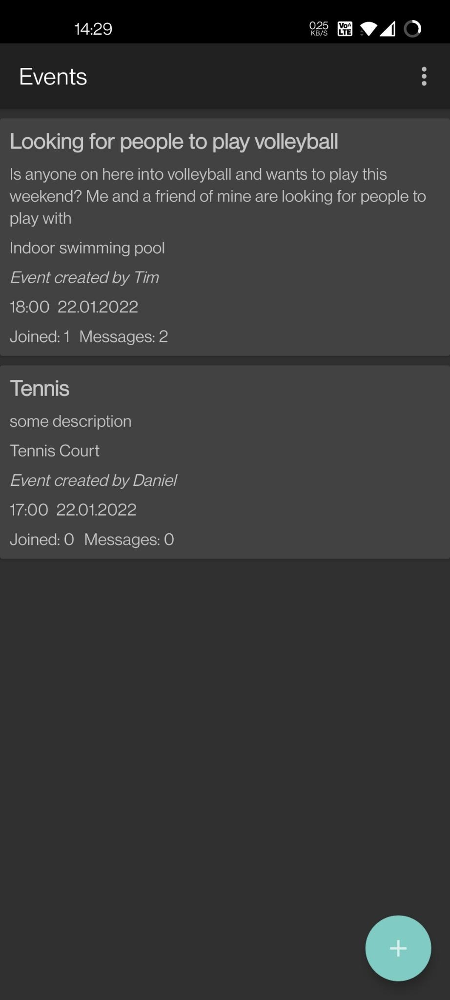

# Assignment Project - Sports App

This repository contains the assignment project for the course [Android Programming with Kotlin (KAPK) - Mr. Drohan - IT, IW - WiSe21/22](http://elearning.uni-regensburg.de/course/view.php?id=51681)

## Table of Contents
1. [Description](#description-of-the-app)
2. [Features](#features)
3. [Images](#images)
4. [References](#references)

## Description of the app
The primary use case of this app is to be used as a platform for people interested in sports activities to meet up in events to do sports together. They can view all current events, join existing ones and create new ones at a specific time and place. Events are also editable but only by the user who created it. Users of the app can also discuss the event using the event specific chat. Additionaly the location of an event can be viewed on a map.

## Features
- View all current events
- Create new events
- Edit the events you have created
- Discuss events using the chat
- View the location where an event takes place on a map
- View all available locations
- Add new locations

## Images

### Splash screen

### Log in

### Register

### Event List

### Event Detail

### Create Event

### Locations List

### Create Location

### Locations Map

###

## References
- [JetBrains Exposed](https://github.com/JetBrains/Exposed)
- [JetBrains Exposed Wiki](http://github.com/JetBrains/Exposed/wiki)
- [Android Developer Time and Date Picker](http://developer.android.com/guide/topics/ui/controls/pickers)
- [Allow database connection in main thread](https://stackoverflow.com/questions/66946890/mysql-android-studio-java-sql-sqlnontransientconnectionexception-could-not-cre)
- [Splash screen](http://geeksforgeeks.org/how-to-create-a-splash-screen-in-android-using-kotlin/)
